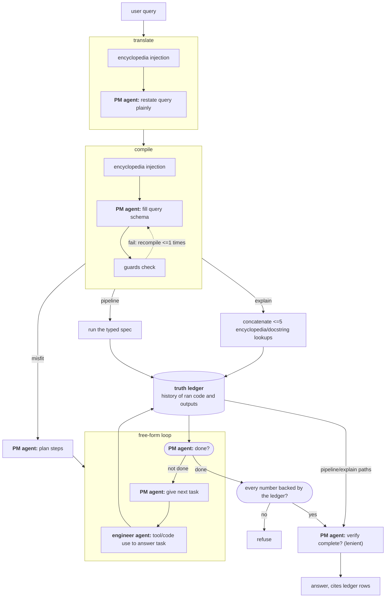
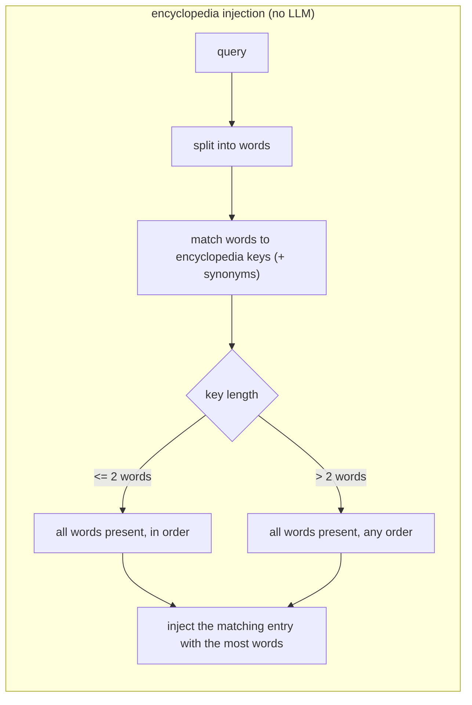

# cytools-agent
*[Nate MacFadden](https://github.com/natemacfadden), Liam McAllister Group, Cornell*

An agent loop and tool harness that lets a local LLM (via [Ollama](https://ollama.com)) drive [CYTools](https://github.com/LiamMcAllisterGroup/cytools) -- fetching polytopes, computing triangulations and Calabi-Yau invariants, running arbitrary CYTools code, and exporting the session as a standalone script.

It treats the model as *helpful but untrustworthy*, never relying on it for the two things models get wrong: its **knowledge** comes from a source-derived encyclopedia and its **results** from a harness-written evidence ledger ([How it works](#how-it-works)).

> **WARNING -- no sandbox.** The `run_python` tool executes model-generated code directly on your machine, with no isolation. Run only models and prompts you trust, on a machine where that is acceptable.

## Installation

```sh
./setup.sh   # conda env + Ollama as an always-on service + default model
conda activate cytools-agent
jupyter lab
```

Open `notebooks/demo.ipynb` with the **Python (cytools-agent)** kernel.

`setup.sh` is idempotent and sets Ollama up as a system service (starts on boot, restarts on crashes, configured with the context window the agent needs; one `sudo` prompt on Linux). After setup there is nothing to start or remember.

## Quick start

Ask research questions through the **orchestrator** -- it plans, executes with the tools, and backs every number with a harness-written evidence log:

```python
from cytools_agent.orchestrator import run_session
print(run_session("Among the first 100 polytopes at h11=3, plot the distribution of NTFE triangulation counts and report the mean."))
```

Questions can sweep Hodge numbers ("at each h11 in [2,10]"), ask for several figures at once, color a scatter by a third quantity, and search ("the largest h11 such that..."). For follow-ups that build on earlier answers, use the stateful chat:

```python
from cytools_agent.orchestrator import OrchestratorChat
chat = OrchestratorChat(model="qwen3:8b")
chat.chat("Fetch the first 25 polytopes at h11=3 and their NTFE counts.")
chat.chat("Now scatter those counts against the polytopes' h21 values.")
```

**Watch it live:** `python -m cytools_agent.viewer`, then open http://127.0.0.1:8765 -- the plan, each step's code and real output, and figures render as the session runs. Archived sessions are browsable there too; `python -m cytools_agent.viewer export` bakes one into a shareable standalone HTML.

**Extra confidence:** `run_session_voted(question, votes=3)` runs independent sessions and accepts an answer only when the final numbers agree; disagreement is flagged rather than silently picked.

There is also a lighter single-agent chat loop (`cytools_agent.agent.Agent`) -- see the notebook for setup. It handles focused questions (one fetch, one invariant, one aggregation) reliably; the orchestrator exists for everything bigger.

## Tools

Polytopes are referenced by canonical string id (`h11-X_h21-Y_ind-Z`); triangulations are passed as height vectors. Tools take ids/heights, not live objects.

> **Note.** These tools are *model-read*: their docstrings are sent verbatim to the LLM as its tool schema, so editing a docstring changes what the model sees. Functions are tagged `# model-read` or `# human-read` in the source; everything under `eval/` is human-read.

| Tool | Description |
|---|---|
| `ks_stats(h11, h21=None)` | Exact polytope count at `(h11[, h21])` from a precomputed table over the full KS database (473M+). Check existence/counts before fetching. |
| `fetch_polytopes(limit, h11, h21=None, favorable=None)` | Up to `limit` Kreuzer-Skarke polytope ids at the given Hodge numbers. Rate-limited and budgeted per session (the database is a shared academic resource). |
| `get_polytope_info(ks_ind)` | One polytope's geometry: Hodge numbers, Euler char, favorability, automorphism order, point/vertex/face counts, 2-face genera. |
| `get_heights(ks_ind, n=None, kind="NTFE", effort=0.5)` | Triangulations as `{"shape": [n_tri, n_pts], "heights": [...]}`. `n` set: a random sample; omitted: all inequivalent (`NTFE`) or all fine-regular-star (`FRST`). `effort` refuses too-large enumerations. |
| `get_triangulation_info(ks_ind, heights)` | Fine/regular/star/valid flags, hash, simplex count for the triangulation defined by `heights`. |
| `get_cy_info(ks_ind, heights, t=None, cone="Kcup")` | CY invariants: Hodge numbers, Euler char, second Chern class, triple intersections, divisor count. `t` (a Kahler-cone point or `"tip"`) adds divisor/CY/curve volumes there. |
| `get_cy_cones(ks_ind, heights, cone="Kcup")` | Mori cone rays = dual Kahler cone hyperplane normals. `"Kcup"` accurate, `"toric"` cheaper at large h11. |
| `compute_for_each(ks_inds, exprs)` | Harness-side iteration: evaluates each expression once per id and stores aligned lists plus exact stats (n/mean/min/max/sum). The model writes a one-item expression; the harness does the loop. |
| `make_plot(kind, x, y, ...)` | Builds and saves a scatter/histogram/line/bar figure from stored list names, with computed data facts (ranges, correlation, outliers) returned alongside. |
| `search_polytopes(condition, objective)` | Budget-aware search over h11 levels for polytopes satisfying a condition ("largest h11 such that..."), reporting exactly what was and was not checked. |
| `run_python(code)` | Arbitrary Python in a persistent namespace (preloaded `cytools`, `numpy`, the tools). Escape hatch; captures stdout, auto-saves figures, wall-clock capped. |
| `cytools_help(name)` | Signature + docstring for a dotted name (e.g. `"Polytope.triangulate"`). API discovery without running code. |
| `cy_glossary(term)` | Domain term -> definition + the exact recipe to compute it with these tools. |

## Use from Claude Code (MCP)

`mcp_server.py` exposes the same tools over MCP, so any MCP client (e.g. Claude Code) can drive CYTools directly, with identical names, docstrings, and schemas. Register once, use everywhere:

```sh
cd /path/to/cytools-agent
claude mcp add --scope user cytools -- \
  conda run --no-capture-output -n cytools-agent python "$(pwd)/mcp_server.py"
```

This makes the tools available in every Claude Code session from any directory; verify with `/mcp`. (`--no-capture-output` is required: stdout is the stdio protocol channel.) Alternatively, the committed `.mcp.json` registers the server at project scope when Claude Code is launched from inside the repo.

The package is an editable install: after `git pull`, just reconnect the server (`/mcp`). Run `conda env update -f environment.yml` only when dependencies change.

## Evaluation

Three question corpora live under `eval/`, differing by who wrote them and whether the answers are known:

| Corpus | Questions | Answers | Written by |
|---|---|---|---|
| `eval/corpus.jsonl` | ~100 single-fact | known, with the code that reproduces each | agent-extracted from CYTools example notebooks |
| `eval/pm_corpus.jsonl` | 10 hard multi-step plot/research | known | agent-authored during development |
| `eval/heldout.jsonl` | 25 authentic research questions | held out (computed later) | **human-written** (frozen; source `n8`) |

(`eval/ladder.jsonl` is a 6-rung difficulty ladder, not a research corpus.) Run from the repo root -- pick the line for the corpus you want:

```sh
# agent-written, known answers -> auto-graded against the stored truths
python -m eval.eval qwen3:8b 30                       # stratified sample of corpus.jsonl
python -m eval.eval qwen3:8b --ids 54,57,58 --reps 3  # targeted re-runs
python -m eval.corpus verify                          # confirm every stored answer still reproduces

# agent-written hard problems -> orchestrator, auto-graded
python -m eval.eval_orch --corpus eval/pm_corpus.jsonl --reps 3 --model qwen3:8b

# human-written questions: truths are held out, so each run is RECORDED (status RUBRIC,
# graded by hand later) rather than auto-scored. The system ladder is the runner that
# handles null answers; it works on ANY corpus, holding the model + questions fixed and
# varying one stack layer per rung L0-L4 (see diagnostics/README.md).
python -m eval.system_ladder --rung L3 --corpus eval/heldout.jsonl --model qwen3:8b

python -m eval.verify_glossary                        # invariants + recipes admission gate
```

The system ladder writes self-describing result files (rung, model, corpus, commit, seed, date + per-question results) to `diagnostics/system_ladder/`, never overwriting a prior run.

## How it works

The harness rests on one principle: **the model is helpful but untrustworthy.** It is never trusted for the two things models get wrong -- what they *know* and what they *claim* -- and each gets a pillar.

### Flow of a query

A question is first restated, then routed by the model into one of three shapes, and finally every number is checked against the evidence before it reaches you:



Routing is model-driven but harness-checked: the compile step is one constrained model call that picks the shape; deterministic guards then validate that choice (and trigger one recompile), and only a clean spec runs. Anything that doesn't fit falls through to the forgiving plan-and-execute. All three paths write the same truth ledger, so the final gate applies no matter which produced the number. The rest of this section unpacks each piece.

Several of those steps -- `translate`, `compile`, and each `plan-and-execute` step -- begin with a deterministic **encyclopedia injection**: the harness matches the text against the glossary and inserts any matching entries (definition + recipe) into the model's prompt.



*(Diagrams are [Mermaid](https://mermaid.js.org) blocks -- they render on GitHub and in editors with Mermaid support.)*

**The pipeline schema.** "fill pipeline schema" means the compile call emits one JSON object with seven always-present keys; the chosen shape is just which of them it fills:

- `fits` -- does the query fit any shape at all?
- `fetch` -- which polytopes to pull: `h11` (a number, a list for a sweep, or null for the whole database), `h21`, `limit` (per h11), `favorable`, `use_stored` (reuse a prior turn's id list).
- `map` -- 1-3 named one-line Python expressions, each run once per fetched polytope to produce a column. The only free-text part of the spec.
- `reduce` -- up to 4 aggregations over those columns, each `{name, op, of}`, where `op` is from a fixed set (mean / min / max / sum / count / argmax / argmin / ...).
- `search` -- SHAPE B: a `condition`, an `objective` (largest_h11 / smallest_h11 / any), optional h11 bounds; else null.
- `explain` -- SHAPE C: `kind` (concept / capability) plus up to 5 lookup `queries`; else null.
- `plot` -- up to 4 figures (`kind` is one of scatter / histogram / line / bar, plus x / y / color / log flags); else null.

The decoder's grammar guarantees the *form* (every key present, enums legal, lists bounded); the guards then check the *content*.

**The encyclopedia -- knowledge from source.** `cy_glossary` / `reference` map a domain term to a *source-derived* definition and the exact recipe to compute it with these tools. `reference()` is indexed: a table of contents over topic sections, with cross-references, so the model can browse rather than guess. Conceptual questions are answered from that text and from real CYTools docstrings -- never from the model's own memory. An admission gate (`eval/verify_glossary.py`) re-runs every recipe and checks the invariants on ~145 polytopes, to catch the encyclopedia drifting from the library it describes.

**The truth ledger -- results from evidence.** Every curated tool call is recorded in a harness-written ledger: exact arguments and structured results, rows the model can read but never author. Answers cite the rows backing each number; a classifier marks every numeric claim row-backed, weaker stdout-backed, or unbacked; and computed data is audited against machine-checked identities (`cytools_agent/tools/invariants.py`) -- on a violation the harness *refuses* rather than guess. The same thinking extends to the data layer: the KS cache is a read-only trusted base no run can poison, plus a writable overlay for newly discovered polytopes.

These two are **model-strength-independent** -- they help a frontier model as much as a small local one, because they replace exactly what no model can be trusted for. On top sits a third, more disposable layer: **permissive scaffolding** that lets a *weak* model actually drive -- a typed pipeline (fetch -> map -> reduce -> plot, or search) the harness executes deterministically, schema-constrained decoding so malformed replies cannot be sampled, and a forgiving plan-and-execute fallback. This is most of the line count and is what lets a weak local model make real progress on the hard plot corpus -- qwen3:8b goes from near-zero single-run to a usable fraction, and higher with self-consistency voting; it matters less as models improve.

Normal use needs none of the knobs below; `setup.sh` configures everything. The scaffolding pieces are flags, on by default, `=0` to disable:

| Flag | What it does |
|---|---|
| `CYTOOLS_SCHEMA_ACT` | Model replies decoded under a JSON Schema, so malformed or empty replies cannot be sampled at all. |
| `CYTOOLS_PIPELINE` | Questions fitting fetch -> map -> reduce -> plot (or search, or explain-from-the-encyclopedia) compile to a typed spec the harness executes deterministically; misfits fall back to the plan-and-execute path. |
| `CYTOOLS_MAP_TOOLS` | `compute_for_each` / `make_plot` / `search_polytopes`. |
| `CYTOOLS_FINISH_FORGIVE` | Accept `answer = ...` scratchpad assignment as the step finish signal (grounding still enforced). |
| `CYTOOLS_NUM_CTX` | Per-request context size (default 16384; `0` = server default). |
| `CYTOOLS_KS_BUDGET` | Real database queries allowed per session (default 40; also `CYTOOLS_KS_MIN_INTERVAL`, `CYTOOLS_KS_MAX_LIMIT`). |
| `CYTOOLS_RUN_TIMEOUT` | Wall-clock cap on one `run_python` call (default 150 s). |
| `CYTOOLS_AGENT_KS_CACHE` / `CYTOOLS_AGENT_KS_BASE` | Opt-in (default off): the writable overlay and read-only trusted base of the persisted polytope cache. Dev feature; grows large. |

The protocol between the PM, the engineer, and the check layers is documented in `cytools_agent/orchestrator/PROTOCOL.md`; the A/B record behind each design choice is in `scratch/AB_RESULTS.md`.
